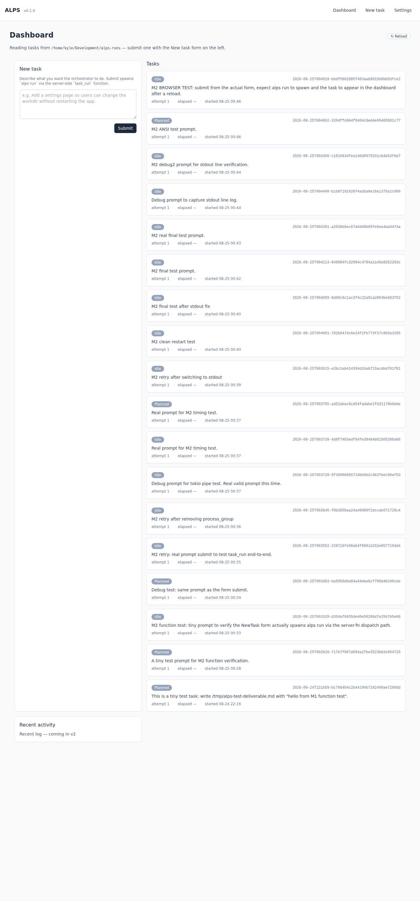
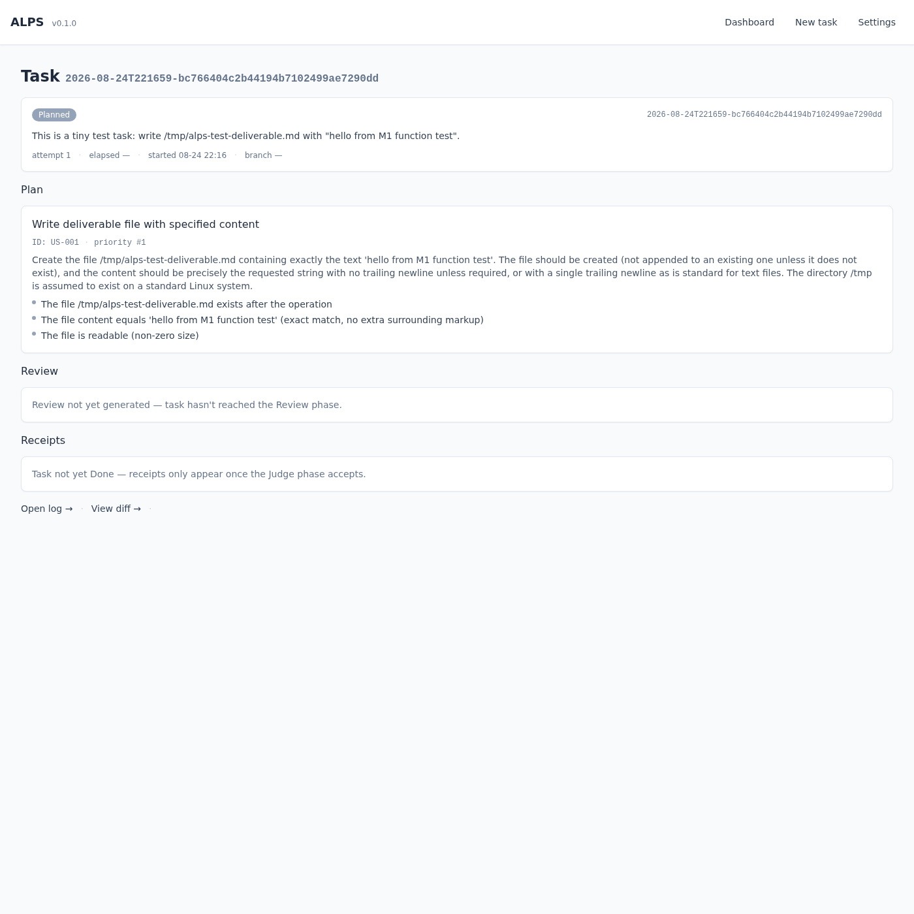
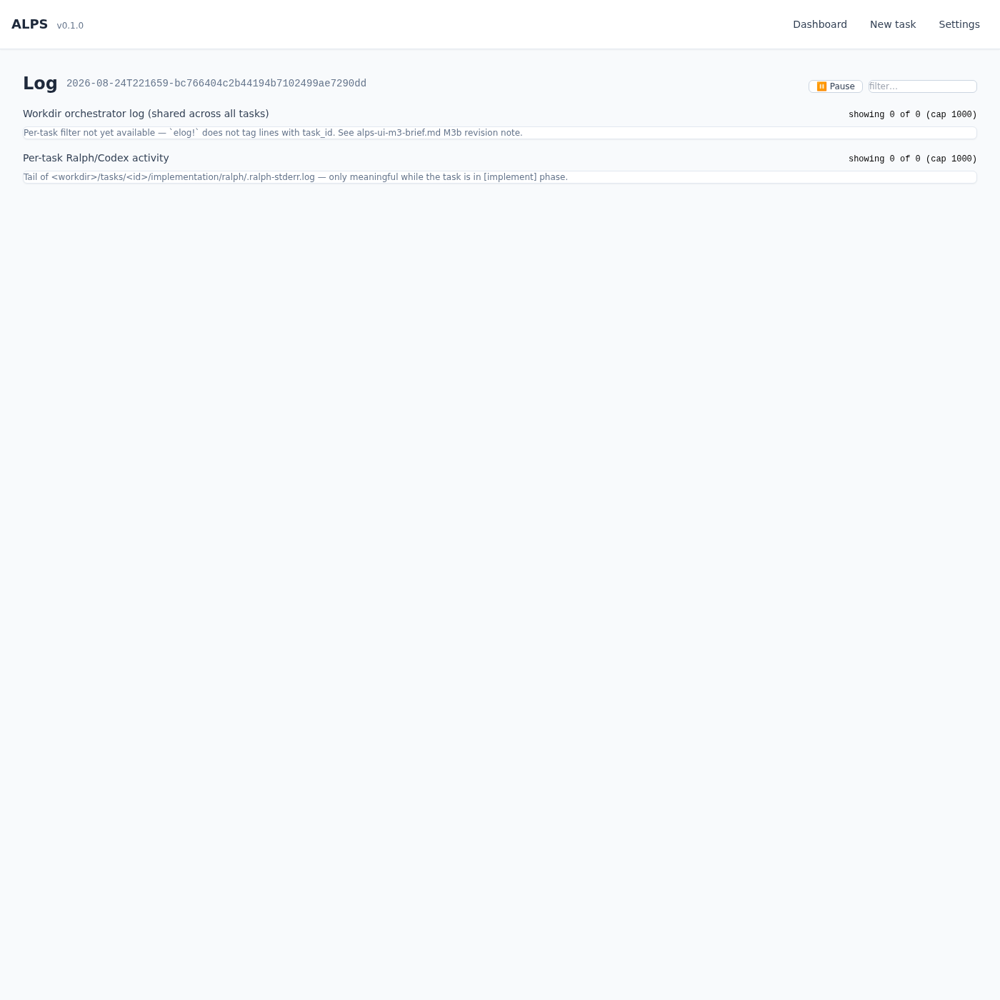
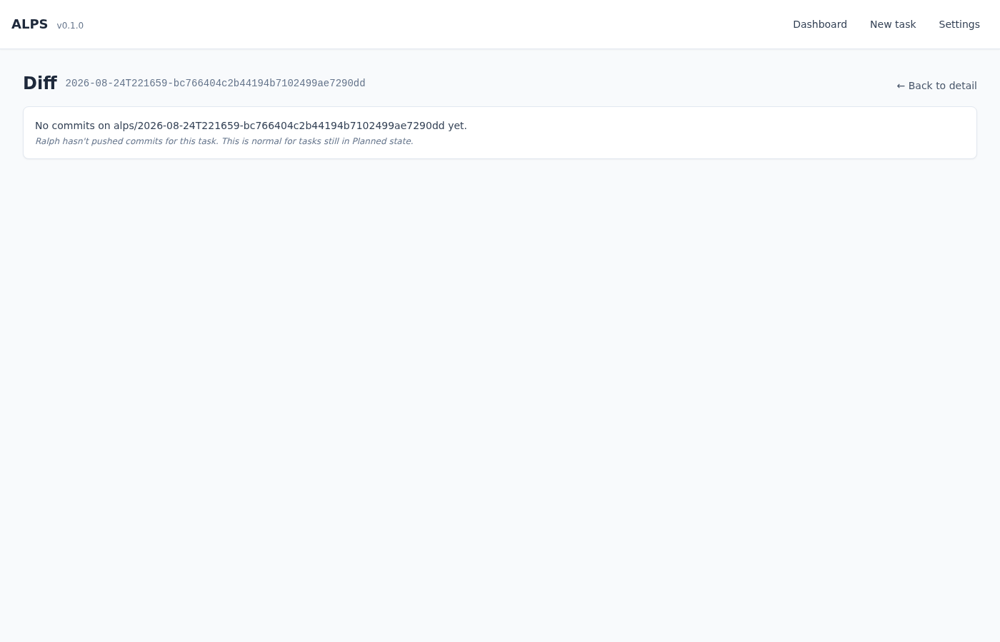
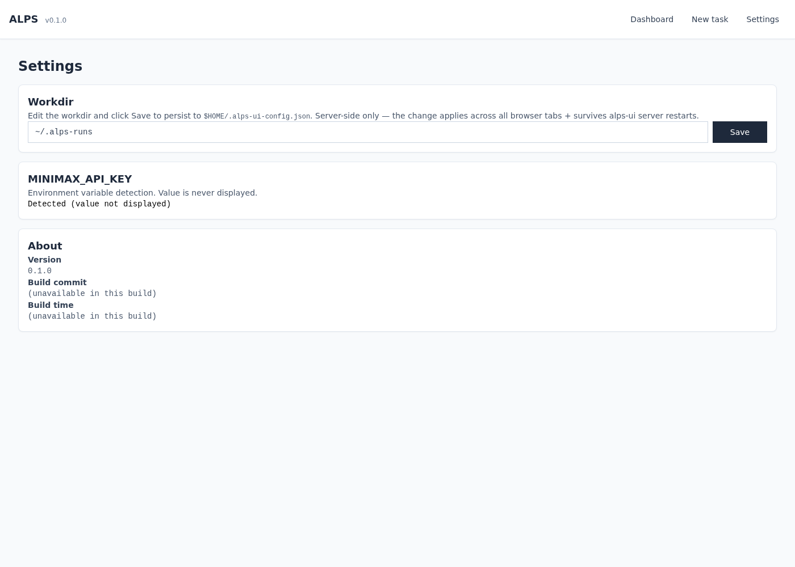
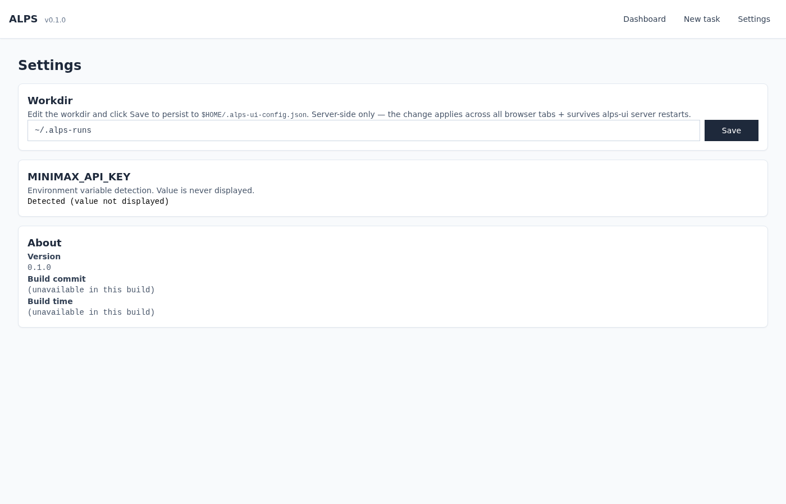

# alps-gui

**Dioxus 0.7 UI for [klampatech/alps](https://github.com/klampatech/alps).**

Single Rust crate (`alps-ui/`) that adds a web + desktop + mobile UI on top of the
ALPS orchestrator without splitting the codebase. The UI is a thin
presentational layer — it reads on-disk artifacts (`tasks/<id>/plan.json`,
`review.json`, `receipts.json`, `AGENTS.md`, etc.) via `alps list --json` /
`alps show --json`, and spawns `alps run` as a child process via the
`task_run` server fn. The orchestrator's type-state machine remains the
single source of truth for state transitions.

## Dashboard



The Dashboard is the home page. The left column has a **New task** form
(textarea + Submit button) that calls the `task_run` server fn, which shells
out to `alps run --prompt-file`. The right column shows every task in the
workdir as a card: StatusPill (Idle / Planned / Running / Done / Failed /
Rejected), task ID, prompt, attempt + elapsed + started metadata. The
subtitle "Reading tasks from /home/kyle/Development/alps-runs" is the
**workdir** propagated from the Settings page via the shared `Workdir`
context (M4-proper, see below).

A New task form submission spawns an `alps run` child process; while it's
running the task StatusPill flips to **Running** and a **Cancel** link
appears next to "Open log →" and "View diff →". Cancel shells out to
`task_cancel`, which kills the child and writes the cancellation to
`.alps-pids.json`.

## TaskDetail



The TaskDetail page (`/tasks/<id>`) renders a single task's full lifecycle:

- **StatusPill** — current state (Planned, Running, Implemented, Done, Failed, Rejected).
- **Prompt + metadata** — the original task text + attempt/elapsed/started/branch.
- **Plan section** — StoryCard from `tasks/<id>/plan.json`. Shows priority,
  ID, full description, and a bulleted list of acceptance criteria. Tasks
  that haven't been planned yet show a "Plan not yet generated" placeholder.
- **Review section** — render of `review.json` as FindingCard / AssertionCard
  components. Shows verdict + findings + assertions. Tasks not yet reviewed
  show a "Review not yet generated" placeholder.
- **Receipts section** — render of the Judge's `receipts.json`. Tasks not
  yet judged show a "Receipts only appear once the Judge phase accepts" placeholder.
- **Footer** — "Open log →" + "View diff →" + (when `state == Running`) **Cancel** link.

Loading is via `use_resource(task_get)`. The page hydrates from SSR HTML
with a loading skeleton, then `task_get` server fn fills in the actual data.

## TaskLog



The TaskLog page (`/tasks/<id>/log`) shows two side-by-side panes:

- **Workdir orchestrator log** — `~/.alps-telemetry.log` (shared across all
  tasks in the workdir, useful for seeing live-ticks + cross-task events).
- **Per-task Ralph/Codex activity** — `<workdir>/tasks/<id>/implementation/ralph/.ralph-stderr.log`
  (only meaningful while the task is in the `[implement]` phase).

Both panes poll every 500 ms via `task_log_tail_telemetry` /
`task_log_tail_ralph` server fns (cursor-based, line-capped at 1000).
Each pane has a filter input + line counter ("showing N of M (cap 1000)")
+ a header banner explaining the file source. A **Pause / Resume** toggle
halts the polling without losing buffered content. The page renders
correctly in SSR (both pane labels + the Pause button are in the initial
HTML — see `scripts/verify-us-007.sh` acceptance criteria #5e-#5g).

Tasks that haven't run yet (Planned / Idle) show "0 of 0 (cap 1000)" — honest
empty state. The screenshot above is a Planned task with no per-task log
activity yet; the UI still renders the full page chrome.

## TaskDiff



The TaskDiff page (`/tasks/<id>/diff`) shows the commits Ralph has pushed
to the task's `alps/<id>` branch against `main`. Implementation:

- **`task_diff` server fn** shells out to `git -C <workdir>/tasks/<id>/implementation/ralph/.git log --format='%H %an %ai %s' alps/<id>..main` followed by `git show <sha> --no-color` per commit.
- **CommitList** — bounded to MAX_COMMITS_TO_RENDER = 50 with a banner
  "X more not shown — view raw git log to see all" (placeholder for v2
  full pagination).
- **Unified diff per commit** — author + date + subject + diff body in
  monospace.
- **Empty state** — "No commits on alps/<id> yet. Ralph hasn't pushed
  commits for this task." (the screenshot above) — for tasks that
  haven't reached the `[implement]` phase.

Tasks with no Ralph commits show the empty state, which is itself
load-bearing copy — it confirms "this task hasn't been implemented yet",
not "this page is broken".

## Settings



The Settings page (`/settings`) is where the user changes the workdir path
without restarting the server. Three cards:

- **Workdir** — text input (pre-filled with the current path) + **Save**
  button. Click Save → `set_workdir` server fn → atomic file write to
  `$HOME/.alps-ui-config.json` → updates the shared `Workdir` context
  → every page that reads from it (Dashboard / TaskDetail / TaskLog /
  TaskDiff / NewTask) sees the new path.
- **MINIMAX_API_KEY** — server-side `std::env::var` detection. The card
  shows "Detected (value not displayed)" in green when the env var is
  set, "Not set in environment" in amber when not. The wasm client shows
  "n/a — browser preview" because `std::env::var` doesn't link on
  `wasm32-unknown-unknown`.
- **About** — package version (from `env!("CARGO_PKG_VERSION")`) +
  build commit + build time (from `option_env!("VERGEN_GIT_SHA")` /
  `VERGEN_BUILD_TIMESTAMP`). Shows "(unavailable in this build)" when
  vergen isn't wired (the current state — vergen integration is a
  follow-up).

After clicking Save:



The green toast "Saved /home/kyle/Development/alps-runs" confirms the
persistence. Click to dismiss. The Settings page also handles errors
from `set_workdir` — failures (e.g. `$HOME` not set, permission
denied) show a red toast with the error message.

The workdir propagates everywhere via the **`Workdir` Dioxus context**
— `provide_workdir()` is called once in `App`, every page reads via
`use_context::<state::Workdir>()`. On mount, an additional `use_future`
in `App` fetches the persisted path via `get_workdir` so wasm clients
correctly initialize with the saved workdir (not the wasm fallback
`~/.alps-runs`). See the Architecture section below.

## Architecture in one sentence

A Dioxus 0.7 fullstack app (`alps-ui/`) that wraps the ALPS orchestrator's CLI
via 8 server fns, all shell-out bridges that call `alps list --json`,
`alps show --json`, or `alps run --prompt-file` — no direct `alps_core`
imports. Persistence is server-side: workdir lives in `$HOME/.alps-ui-config.json`,
PID registry in `<workdir>/.alps-pids.json`.

## Server fns

All behind `#[server]` (gated by `#[cfg(feature = "server")]`), with hand-rolled
wasm stubs (also under `#[cfg(not(feature = "server"))]`) so the same compile
target produces a wasm client + a server binary. Hashes are macro-generated
and discovered at runtime from dx serve's startup log.

| Server fn | Wraps | Notes |
|---|---|---|
| `tasks_list(workdir)` | `alps list --json --workdir <w>` | JSON contract merged in `feat/alps-gui-prereq` (PR #23) |
| `task_get(workdir, id)` | `alps show --json --workdir <w> <id>` | Returns `Ok(None)` on CLI exit code 2 (not-found) |
| `task_run(workdir, deliverable, prompt)` | `alps run --prompt-file <p>` | Spawns child + writes `.alps-pids.json` atomically |
| `task_log_tail_telemetry(workdir, cursor)` | reads `~/.alps-telemetry.log` | Cursor-based, line-capped at 500 per response |
| `task_log_tail_ralph(workdir, task_id, cursor)` | reads `<workdir>/tasks/<id>/implementation/ralph/.ralph-stderr.log` | Same shape |
| `task_diff(workdir, task_id)` | `git log alps/<id>..main` + per-commit `git show` | `CommitDiff { sha, author, date, subject, diff }` |
| `task_cancel(workdir, task_id)` | Kills child from in-memory registry; fallback reads `.alps-pids.json` | `CancelOutcome { cancelled_pid, source }` |
| `get_workdir()` / `set_workdir(path)` | reads / writes `$HOME/.alps-ui-config.json` | Atomic temp + rename; `set_workdir` is single-arg `path` |

## Pages (`alps-ui/src/pages/`)

| File | Purpose |
|---|---|
| `dashboard.rs` | Home (`/`) — task list + New task form |
| `task_detail.rs` | `/tasks/<id>` — StatusPill + Plan/Review/Receipts |
| `task_log.rs` | `/tasks/<id>/log` — dual-pane polled logs |
| `task_diff.rs` | `/tasks/<id>/diff` — git alps/<id>..main diff |
| `settings.rs` | `/settings` — Workdir + MINIMAX_API_KEY + About |
| `new_task.rs` | `/tasks/new` — full-page prompt form (linked from nav) |
| `not_found.rs` | Fallthrough for unknown routes |

All five "real" pages share the **`state::Workdir` context** — `use_context::<state::Workdir>().get()`
returns the current workdir, set at App mount via `provide_workdir()` + updated by Save in Settings.

## Repository layout

```
klampatech/alps-gui/                     # THIS repo
├── Cargo.toml                           # own Cargo workspace (alps-ui + alps-core rel path)
├── README.md                            # this file
├── SPEC.md                              # detailed design (803 lines; vault is source of truth)
├── DESIGN.md                            # visual language spec
├── alps-ui/                             # the GUI crate
│   ├── Cargo.toml
│   ├── Dioxus.toml
│   ├── tailwind.config.js
│   ├── assets/                          # main.css + tailwind.css (post-Tailwind JIT compile output)
│   ├── public/                          # dx serve bundle output (gitignored)
│   ├── src/
│   │   ├── main.rs                      # App + Router + Stylesheet + Workdir use_future
│   │   ├── routes.rs                    # typed Route enum (7 variants)
│   │   ├── domain.rs                    # re-exports from alps_core + UI TaskId wrapper
│   │   ├── state.rs                     # M4-proper: Workdir context + provide_workdir()
│   │   ├── layouts/
│   │   │   ├── mod.rs
│   │   │   └── nav.rs                   # NavBar (ALPS v0.1.0 + Dashboard / New task / Settings)
│   │   ├── pages/                       # 7 pages (see above)
│   │   ├── components/                  # StatusPill, StoryCard, FindingCard,
│   │   │                                 #   AssertionCard, ReceiptCard, ResponsiveGrid
│   │   └── api/                         # 8 server fns (all #[cfg(feature = "server")])
│   │       ├── mod.rs                   # hand-rolled wasm + native stubs
│   │       ├── tasks.rs                 # tasks_list + task_get
│   │       ├── run.rs                   # task_run (+ PID registry insert + .alps-pids.json write)
│   │       ├── log.rs                   # task_log_tail_telemetry + task_log_tail_ralph
│   │       ├── diff.rs                  # task_diff + CommitDiff
│   │       ├── cancel.rs                # task_cancel + PID registry + .alps-pids.json pruner
│   │       ├── process_registry.rs      # in-memory OnceLock<Mutex<HashMap>> child registry
│   │       └── workdir.rs               # M4-proper: get_workdir + set_workdir
│   └── tests/                           # integration tests (cargo test --bin alps-ui)
├── scripts/
│   └── verify-us-007.sh                 # 21 acceptance criteria (build + clippy + dx serve + curls)
├── docs/
│   └── screenshots/                     # README screenshots (this dir; 6 PNGs)
└── .github/
    └── workflows/ci.yaml                # 2 jobs: build + test / verify-us-007.sh
```

## Status

**alps-gui v0.1.0 — milestone M4-proper complete (PR #9).** Total: 5 milestones
merged or in-review, all backed by verify-script acceptance criteria.

| Milestone | PR | Description | Status |
|---|---|---|---|
| M0 (smoke-A1) | — | 8 fixture states served from in-memory; first runnable UI | ✅ |
| M1 (Dashboard hydration) | #1 | Live `tasks_list` + task cards | ✅ merged |
| M2 (`task_run`) | #4 | Server-fn dispatch surface; spawning real children | ✅ merged |
| M3a (TaskDetail) | #5 | StatusPill + Plan/Review/Receipts + Cancel signal | ✅ merged |
| M3b (TaskLog) | #6 | Dual-pane polled tails with Pause | ✅ merged |
| M3c (TaskDiff + cancel) | #7 | `task_diff` server fn + `task_cancel` + `.alps-pids.json` write | ✅ merged |
| M4-prep (Settings UI shell) | #8 | Settings page UI (Workdir + MINIMAX_API_KEY + About) | ✅ merged |
| M4-proper (workdir context + persistence) | #9 | Shared `Workdir` context + server-side persistence | ✅ merged |
| M5 (Playwright e2e + snapshots) | — | Visual snapshots at 375 / 768 / 1280px | ⏳ next |

**Acceptance verification:** `bash scripts/verify-us-007.sh --port <PORT>`
runs 21 criteria end-to-end and exits 0 when green. Last verified locally
2026-08-27 (21/21 pass). CI enforces the same suite on every PR.

## Build + run

```bash
# Web (server + wasm) — recommended
cd alps-ui && dx serve --platform server --features server
# → http://127.0.0.1:5274/  (port configurable with --port)

# Verify the acceptance criteria (21 total)
bash scripts/verify-us-007.sh --port 5274

# Desktop (fullstack)
cd alps-ui && dx serve --features fullstack
```

Requires: Rust stable, Dioxus CLI (`cargo install dioxus-cli`), the
matching `alps` orchestrator CLI on $PATH (built from
[klampatech/alps](https://github.com/klampatech/alps)).

## Pitfalls + gotchas

Captured during M3 + M4 work, see
[`references/dioxus-0.7-m3-pitfalls.md`](https://github.com/klampatech/.hermes/blob/main/skills/projects/alps-gui/references/dioxus-0.7-m3-pitfalls.md)
for the full list. Standouts:

- **#32 (CI parity)** — pre-push must run BOTH `cargo test --bin alps-ui`
  AND `cargo test --bin alps-ui --features server`. CI line 72 is the
  no-features variant only.
- **#39 (visual verification)** — text-only browser function tests miss
  visual regressions (e.g. invisible buttons, off-by-one CSS). Always
  capture screenshots after UI PRs.
- **#42 (hook-list double-borrow)** — `use_context_provider(|| { use_signal(...) })`
  panics in SSR tests. Split into separate statements.
- **#44 (bash quote escaping)** — `"{\"key\":\"$X\"}"` strips inner quotes.
  Use `'\''json'\'' + "\"" + $X + "\""' ""` pattern (or printf).

## Author

Evo + Kyle. See `~/Obsidian/projects/alps-ui-spec.md` for the canonical design
doc + current milestone status.